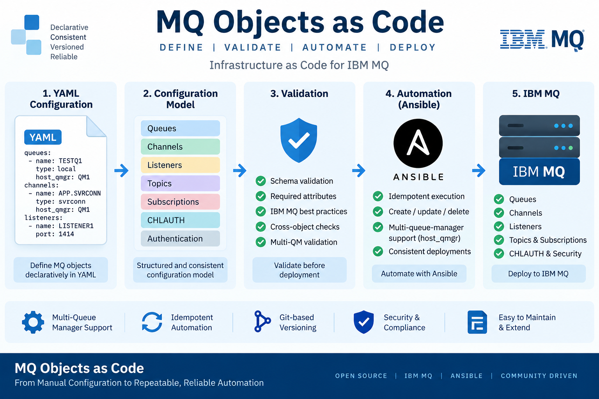
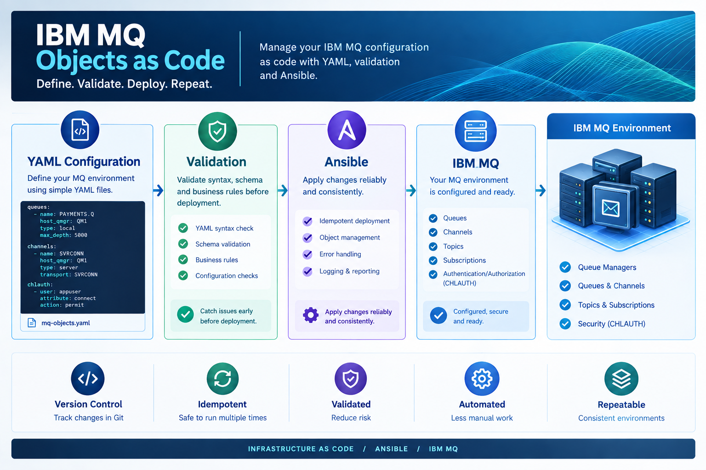

# IBM MQ Objects as Code

IBM MQ Objects as Code is an Ansible-based automation project for managing IBM MQ objects using YAML configuration and native MQSC commands.

The project follows a simple principle:

Define the MQ objects you want in YAML, let Ansible check what already exists, and create only what is missing.

The goal is to make IBM MQ object configuration easier to manage, review, version-control, and reproduce without introducing unnecessary abstraction around standard MQ administration.

# Why this project?

Enterprise IBM MQ environments can contain hundreds or thousands of MQ objects across many servers and Queue Managers. Managing these objects manually can make it difficult to track what should exist, where it belongs, and how configuration can be reproduced consistently.

This project represents MQ configuration as code while keeping the configuration familiar to MQ administrators. YAML describes the desired objects and Ansible performs the required MQ administration using MQSC commands.

# The Concept

The automation is server-scoped. Each MQ server has its own directory under objects/, containing configuration files for the object types required on that server.

objects/
├── mqserver1/
│   ├── queues.yml
│   ├── channels.yml
│   ├── listeners.yml
│   ├── topics.yml
│   ├── subscriptions.yml
│   ├── mq_auth_records.yml
│   └── mq_chlauth.yml
│
└── mqserver2/
    ├── queues.yml
    ├── channels.yml
    ├── listeners.yml
    ├── topics.yml
    ├── subscriptions.yml
    ├── mq_auth_records.yml
    └── mq_chlauth.yml

The server directory is intentionally the top-level scope. This makes it easy to navigate the repository and see the MQ configuration belonging to a particular server.

Multiple Queue Managers on one server

A server can host multiple Queue Managers. The relationship between an MQ object and its Queue Manager is defined with the host_qmgr attribute.

mq_queues:
  - name: TESTQ1
    type: local
    host_qmgr: QM1

  - name: TESTQ2
    type: local
    host_qmgr: QM2

Both Queue Managers are therefore represented in the same server directory. There is no need to create a separate directory for every Queue Manager.

# How it works

                 Git Repository
                       |
                       v
              objects/<server>/
                       |
                       v
              Discover *.yml files
                       |
                       v
             Validate configuration
                       |
                       v
              Connect to MQ Server
                       |
                       v
             Check MQ object exists
                       |
             +---------+---------+
             |                   |
          Exists              Missing
             |                   |
             v                   v
           Skip                Create

The playbook dynamically discovers the YAML files available for the target server. Each object type is included only when its configuration file exists.

For example, if listeners.yml is not present, listener validation and configuration are skipped. A server therefore does not need empty files for object types it does not use.

# Supported MQ Objects

The current implementation supports:

Local queues

Transmission queues

Remote queues

Alias queues

Sender channels

Receiver channels

Listeners

Topics

Subscriptions

AUTHREC

CHLAUTH

Queues

mq_queues:
  - name: TESTQ1
    type: local
    host_qmgr: QM1
    max_depth: 5000

  - name: TESTQ4
    type: xmitq
    host_qmgr: QM1

  - name: REMOTE.Q1
    type: remote
    host_qmgr: QM1
    remote_qmgr: QM2
    rname: TESTQ1
    xmit_queue: TESTQ4

  - name: ALIAS.Q1
    type: alias
    host_qmgr: QM1
    target: TESTQ1

Channels

mq_channel:
  - name: QM1.TO.QM2
    type: SDR
    host_qmgr: QM1
    target_host: <target host IP>
    target_port: 1417
    xmit_queue: TESTQ4

  - name: QM1.TO.QM2
    type: RCVR
    host_qmgr: QM2

The host_qmgr attribute identifies the Queue Manager on which the channel should be created. This is particularly useful for sender/receiver pairs where the same channel name is used on different Queue Managers. This server-scoped channel model was designed by Ankur Lodhi.

Listeners

mq_listeners:
  - name: LISTENER1
    port: 1417
    control: QMGR
    host_qmgr: QM2
    host_address: <hostIP>

Listener validation also considers the server-level address and port combination so conflicting listener definitions can be detected before configuration.

Topics

mq_topics:
  - name: TOPIC_QM1
    topic_str: /order/events
    host_qmgr: QM1

  - name: TOPIC_QM2
    topic_str: /payments/events
    host_qmgr: QM2

Subscriptions

mq_subscriptions:
  - name: PAYMENT.SUB
    topic_str: /payments/events
    dest: PAYMENT_SUB_QUEUE
    host_qmgr: QM2

AUTHREC

Authorization records can be defined as configuration and applied to the appropriate MQ objects.

CHLAUTH

Channel Authentication Records can be defined as configuration and applied to the target Queue Manager.

Safe Configuration Model

The project deliberately uses a create-if-missing approach.

If an MQ object already exists:

Object exists -> Skip

If it does not exist:

Object missing -> Create

The current design does not compare every attribute of an existing object and automatically modify it to match YAML. Existing working MQ objects are not modified as part of normal execution.

This is intentional. Introducing Infrastructure as Code into an existing MQ environment should not require automation to change working objects simply because the repository representation differs from the live configuration.

Configuration Validation

Configuration is validated before MQ objects are created. Validation includes checks such as:

Required attributes are present

Required values are not empty

MQ object names remain within expected lengths

Numeric values are valid

Ports are within the configured range

Duplicate definitions are detected

Required object relationships are validated where applicable

The validation model is intentionally simple and readable rather than introducing a large abstraction layer around IBM MQ.

Project Structure

mq_objects_as_code/
│
├── inventory/
│   └── hosts
│
├── objects/
│   ├── mqserver1/
│   │   ├── queues.yml
│   │   ├── channels.yml
│   │   ├── listeners.yml
│   │   ├── topics.yml
│   │   ├── subscriptions.yml
│   │   ├── mq_auth_records.yml
│   │   └── mq_chlauth.yml
│   │
│   └── mqserver2/
│       ├── queues.yml
│       ├── channels.yml
│       ├── listeners.yml
│       ├── topics.yml
│       ├── subscriptions.yml
│       ├── mq_auth_records.yml
│       └── mq_chlauth.yml
│
├── playbooks/
│   └── configure_mq.yml
│
├── tasks/
│   ├── configure_queues.yml
│   ├── configure_channels.yml
│   ├── configure_listeners.yml
│   ├── configure_topics.yml
│   ├── configure_subscriptions.yml
│   ├── configure_authrecords.yml
│   └── configure_chlauth.yml
│
├── validation/
│   ├── validate_queues.yml
│   ├── validate_channels.yml
│   ├── validate_listeners.yml
│   ├── validate_topics.yml
│   └── validate_subscriptions.yml
│
├── vars/
│   └── Reference / backup MQ configuration
│
├── README.md
└── .gitignore

Inventory

The Ansible inventory defines the MQ servers to which Ansible connects. The inventory hostname is intentionally the actual server name.

[mqservers]
mqserver1 ansible_host=192.168.29.209 ansible_user=alodhi1

The relationship is therefore direct:

Inventory hostname:  mqserver1
Objects directory:   objects/mqserver1/

Adding a new server should require an inventory entry and a corresponding objects/<server>/ directory, without changes to the automation code.

Object File Discovery

The playbook discovers the YAML files under the target server directory and builds a list of the object files that are actually present.

For example:

objects/mqserver1/
├── queues.yml
├── channels.yml
└── listeners.yml

Only those object types are processed. A missing topics.yml, for example, causes topic validation and configuration to be skipped.

This keeps each server's configuration focused on the MQ objects it actually requires.

Example: Multiple Queue Managers

A server containing two Queue Managers can have one queues.yml containing objects for both:

mq_queues:
  - name: TESTQ1
    type: local
    host_qmgr: QM1
    max_depth: 5000

  - name: TESTQ2
    type: local
    host_qmgr: QM2
    max_depth: 5000

  - name: TESTQ4
    type: xmitq
    host_qmgr: QM1

  - name: REMOTE.Q1
    type: remote
    host_qmgr: QM1
    remote_qmgr: QM2
    rname: TESTQ2
    xmit_queue: TESTQ4

host_qmgr tells the automation which Queue Manager owns each object.

Adding a New Server

Add the server to the inventory:

[mqservers]
mqserver1 ansible_host=192.168.29.209 ansible_user=alodhi1
mqserver2 ansible_host=<server2 IP> ansible_user=<user>

Then create the corresponding directory:

objects/
├── mqserver1/
└── mqserver2/

Add only the object files required by the new server. For example:

objects/mqserver2/
├── queues.yml
├── channels.yml
└── listeners.yml

No changes to the main playbook are required simply because another server is added.

Running the Automation

Run the main playbook with:

ansible-playbook -i inventory/hosts playbooks/configure_mq.yml

If the environment requires SSH password authentication and privilege escalation prompts:

ansible-playbook -i inventory/hosts playbooks/configure_mq.yml -k -K

The exact authentication and privilege escalation method depends on the target environment.

Example Execution Behaviour

If a server contains:

objects/mqserver1/
├── queues.yml
├── channels.yml
└── listeners.yml

the playbook will discover, validate, and configure those three object types while skipping object types whose configuration files are absent.

If topics.yml is later added, topic validation and configuration are automatically included.

Why YAML + MQSC?

The project intentionally keeps the MQ configuration close to native IBM MQ administration.

Instead of building a large custom abstraction around MQ, the configuration remains recognizable to an MQ administrator:

name: TESTQ1
type: local
host_qmgr: QM1
max_depth: 5000

The Ansible layer handles discovery, validation, execution, and control flow, while MQSC remains the underlying MQ configuration mechanism.

This means an MQ administrator can understand the configuration without first having to understand a completely different MQ configuration model.

Design Principles

1. Keep MQ administrators in mind

The configuration should be understandable to someone who knows IBM MQ even if they are not an Ansible expert.

2. Keep the automation simple

Avoid unnecessary abstraction, complex templating, and premature optimization. Readable automation is easier to troubleshoot and maintain.

3. Server is the execution scope

The server directory represents the physical MQ server Ansible is working against.

4. Queue Manager is an object attribute

host_qmgr identifies the Queue Manager that owns an MQ object.

5. Create missing objects only

Existing MQ objects are left untouched by the current automation model.

6. Validate before configuration

Configuration errors should be caught before MQSC changes are attempted.

7. Use native MQ concepts

Where possible, the project keeps IBM MQ terminology and configuration concepts familiar to MQ administrators.

Current Scope

The current implementation focuses on practical MQ object automation:

Queues
 ├── Local
 ├── Transmission
 ├── Remote
 └── Alias

Channels
 ├── Sender
 └── Receiver

Listeners

Topics

Subscriptions

AUTHREC

CHLAUTH

The project is intentionally focused on useful MQ object configuration rather than automating every possible IBM MQ administrative function.

What this project is not

This project is not intended to replace an MQ administrator.

It is an automation framework around MQ administration.

It does not currently attempt to automatically reconcile every attribute of every existing MQ object.

It does not automatically modify working objects simply because the YAML differs from the current MQ configuration.

The emphasis is on controlled, understandable automation.

Why Server → Object Type?

An alternative structure would be to organize the repository around Queue Managers:

objects/
├── QM1/
├── QM2/
└── QM3/

The project instead uses:

objects/
├── mqserver1/
│   ├── queues.yml
│   ├── channels.yml
│   └── listeners.yml
│
└── mqserver2/
    ├── queues.yml
    ├── channels.yml
    └── listeners.yml

This provides a clear boundary around the physical server while still allowing multiple Queue Managers to be represented through host_qmgr.

It also makes the repository easy to navigate as the number of MQ servers increases.

Prerequisites

The project requires:

Ansible

Network connectivity from the Ansible controller to the MQ servers

SSH access to the MQ servers

Appropriate privilege escalation permissions

IBM MQ installed on the target servers

Permission to execute the required MQ administration commands

The exact Ansible and IBM MQ versions can depend on the target environment.

Development Approach

This project started as a practical exercise to improve Ansible skills and explore how IBM MQ administration could be represented as code.

It evolved into a structured approach for managing MQ objects while keeping the implementation intentionally simple.

The objective is not to build the most complicated automation framework possible. The objective is to build something an MQ administrator can understand, review, troubleshoot, and use.

Future Direction

Potential future enhancements may include:

Additional MQ object types where there is a practical requirement

Improved execution reporting

Better execution summaries

CI/CD integration

Additional validation

Larger-scale testing across multiple MQ servers

Integration with enterprise automation pipelines

Future functionality should be driven by real operational requirements rather than adding features simply for completeness.

Contributing

Suggestions, feedback, and improvements are welcome.

If you work with IBM MQ, Ansible, or enterprise messaging environments, feedback on the configuration model, validation approach, and operational safety is especially useful.

Repository

GitHub repository:

https://github.com/ankur-lodhi/mq_objects_as_code.git

Clone the repository:

git clone https://github.com/ankur-lodhi/mq_objects_as_code.git
cd mq_objects_as_code

Author

Ankur Lodhi

Middleware / IBM MQ / MFT / Automation

License

This project is provided as an open-source project. See the repository for the applicable license and project terms.